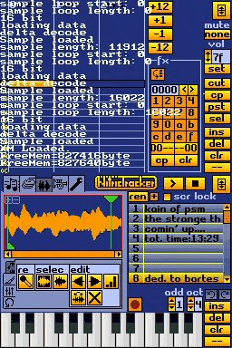
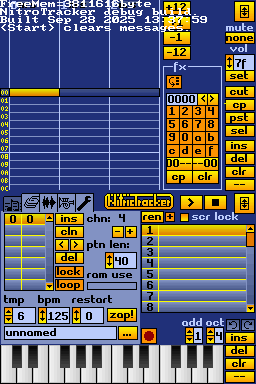
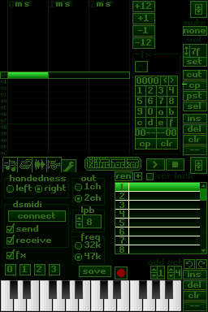
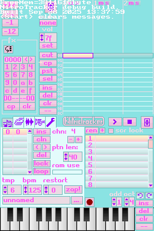
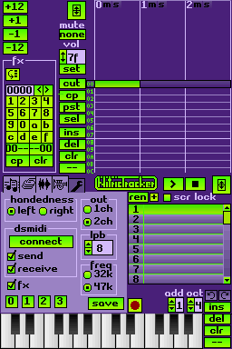

"NitricTracker"
-

This is my fork of NitrousTracker which I use as a test bed for random features before attempting to clean them up and merge requesting upstream.

[Click here to download the latest artifact (nds builds)](https://nightly.link/prayerie/nitrictracker/workflows/build.yaml/new/NitricTracker.zip). Note that nothing in here is final, the implementation is extremely unstable, and any change that does make it through will be fully rewritten.

**You will experience frequent crashes and lose work** - this build serves as more of a proof of concept (if you have feedback regarding any proposed changes, please join the unofficial NitroTracker discord and ping me, or make an issue here). Also, this repository will lag behind upstream a lot.  

If you do experience a crash (or "RSOD"), a photo of the red screen, alongside what you were doing, would be of great help. 

This repo will not have any formal numbered releases, as when the changes here are stable I will just merge request NitrousTracker.

now with a working playback cursor!



more screenshots:



### Status

- [ ] rework fx keypad (exolotl design)
- [x] themeing support (mostly done, add Theme.conf(?))
- [ ] sample duplication
- [ ] somehow include sample edits in undo buffer (maybe?)
- [ ] inst swap
- [ ] lowpass/highpass/bandpass filter for sample
- [x] sample playback cursor
- [ ] .MOD playback (not write) support
- [ ] interpolate fx between start and end fx
- [ ] support for reading openmpt .xm format additions


original readme:
```

      NitrousTracker v0.4.15
     --------------------------------
     original by 0xtob ^ 0x80
          modifications by asie & co.

-- About

NitrousTracker is a fork of NitroTracker, a FastTracker II
style tracker for the Nintendo DS originally created by
0xtob. If you didn't understand that, you might want to
read up on trackers. For starters, NitrousTracker is a
versatile tool for creating music - everywhere! It supports
the popular XM file format that is used by many PC trackers
and that can be played on many PC audio players such as
Winamp or XMMS.

-- Installation

Copy NitrousTracker and some music and samples to
any folder of your memory card and start tracking!

-- Community

Forum:

    http://modarchive.org/forums/index.php?board=79.0

-- I want *you* for NitrousTracker!

What you can do:

    Find bugs and request features!

        Bug reports and feature requests are collected here:

        https://github.com/asiekierka/nitrotracker/issues

        If you have something that isn't already on that list, feel
        free to add it.

        Keep in mind that many reported requests remain preserved
        on the old issue tracker, now at:

        https://github.com/0xtob/nitrotracker/issues

    Become a NitrousTracker developer!

        The source and all the info on how to get started is here:

        https://github.com/asiekierka/nitrotracker

        If you want to contribute a pull request, go right ahead!

-- Contact

Get in touch with other NitrousTracker users in the official
The NitroTracker Forum (see above).

-- Thanks

Big thanks to 0xtob for the work on NitroTracker and for
making it available under a free software license.

I'd also like to thank reinvdwoerd for their original
work and ideas regarding improving NitroTracker, started
shortly prior to my own work!

AntonioND's BlocksDS toolchain has allowed incorporating
many long put off backend improvements. It builds on the
work of many giants, including the dozens of contributors
to devkitPro-maintained libraries comprising the devkitARM
toolchain, who should also be thanked and acknowledged.

0xtob originally thanked:

There is quite a bunch of people that made the development
of this project possible or easier. First of all, a huge
thank you to the NitroTracker beta testers, for providing
tons of ideas and helping me find even the most obscure
bugs:

alienspurm, andars, atomtwist, Biiaru, chrislody, grobsen,
Ignatzthemouse, infradead, Jono-60, license, lotlemmwax,
nitro2k01, nonfinite, parkstenator, reSet, Shagbat,
silent_code, spielor, totoee, Vengeful Parasite, willgripp

NitroTracker is built on the hard work of a lot of people
who work on DS homebrew mostly in their spare time. This
list is by nomeans comprehensive, so please don't sue me
if you are missing your name here :-)

    * joat, dovoto and WinterMute for libnds and devkitPro
    * chishm for the universal FAT library
    * sgstair for the incredible wifi lib
    * Headspin for the great on-screen typewriter design
    * doublec for his ds development tutorials that got me
      started with DS coding
    * Martin Korth for the incredible gbatek reference and
      the no$gba emulator
    * My friends in #dsdev for patiently answering my
      questions
    * starpause for providing the samples used in the
      tutorial
    * Michael Krause for the open source SoundTracker,
      that was a great help with the XM format
    * Last but not least: Vogue and Mr.H of Triton for
      Fasttracker II, the tracker that NitroTracker was
      designed after.
```

